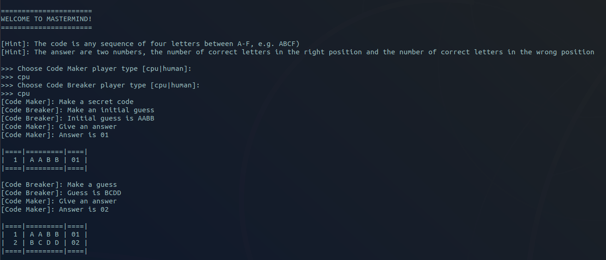

Mastermind
----------

An implementation of the famous game Mastermind.

Each player can be either a human or a computer. The computer code breaker player implements the Five-guess algorithm defined by Donald Knuth (1977). The original paper can be found [here](http://www.cs.uni.edu/~wallingf/teaching/cs3530/resources/knuth-mastermind.pdf).

#### Requirements

- Python 3 

#### Run

The game can be started with:

```python
python3 mastermind.py
```

